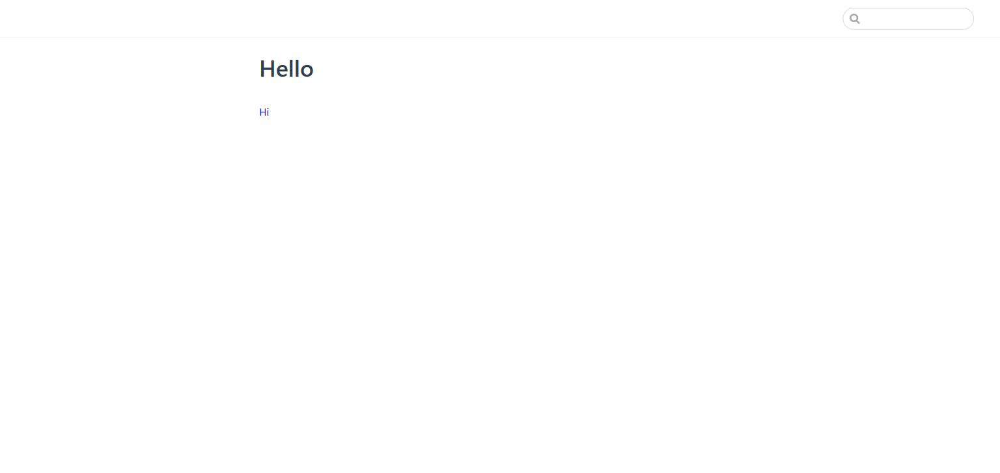
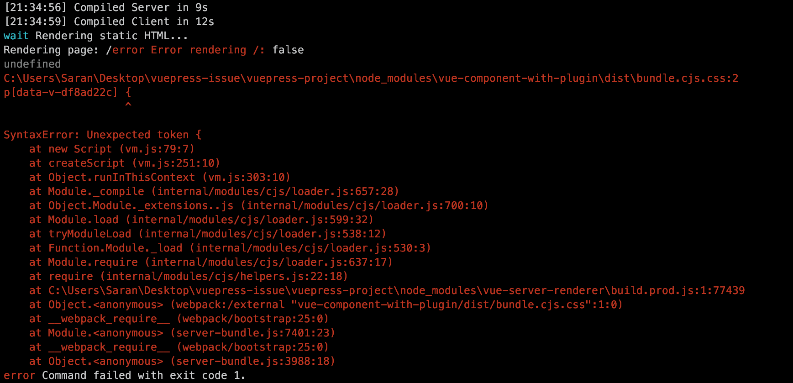

# VuePress plugin issue

A repo to repro import error on VuePress.

## Steps to repro

1. Build the example VuePress plugin.  
   ```sh
   cd vue-component-with-plugin/
   yarn
   yarn build
   cd .. # Go back to root directory
   ```
2. Try to run VuePress project on dev mode.
   ```sh
   cd vuepress-project
   yarn
   yarn dev

   # Then open dev page. It works!
   ```

   

3. Finally, build VuePress project.
   ```sh
   yarn build

   # Error throwed !!
   ```

   
